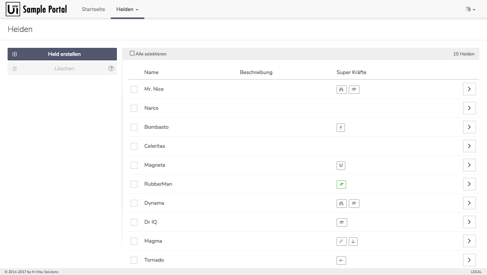

# Uikit Sample Portal
[Check out the live demo](https://mwaylabs.github.io/uikit-sample-portal)

[](https://mwaylabs.github.io/uikit-sample-portal)

This sample portal is using the [mw-uikit](https://github.com/mwaylabs/uikit) to demonstrate its
features. It is a simple CRUD application to create, read, update and delete heroes similiar to the Angular
[Tour of Heroes](https://angular.io/docs/ts/latest/tutorial/) getting started guide.

All steps to build the portal are documented here: https://github.com/mwaylabs/uikit-sample-portal/wiki

For the API a simple [json-server](https://github.com/typicode/json-server) was set up to store the data. 

The server is deployed via AWS Code Deploy on an EC2 instance. All steps for the AWS deployment are documented [here](./json-server/README.md)

## Development
To run the sample portal on your machine clone this repository and run 
```
npm install
```

To start the portal run

```bash
npm start
````

Open a new terminal window to start the json-server

```bash
npm run server
```

